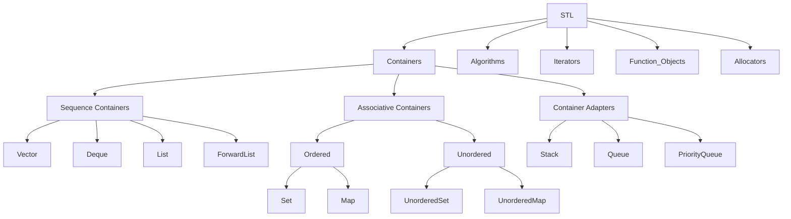

## C++ STL

STL，全称Standard Template Library（标准模板库），是C++标准库的一部分。它包含了一系列的模板类和函数，主要用于数据处理和算法操作。STL的主要内容包括：

1. `容器（Containers）`：如vector、list、deque、set、map等，用于存储和操作数据。
2. `算法（Algorithms）`：如sort、find、copy、for_each等，提供了一系列对容器进行操作的通用算法。
3. `迭代器（Iterators）`：提供了一种方法，可以按照一定的顺序访问容器中的元素，而无需暴露容器的内部表示。
4. `函数对象（Functors）`：这是一种特殊的对象，可以像函数一样被调用。函数对象通常用于创建可定制的算法。
5. `适配器（Adapters）`：如stack、queue、priority_queue等，它们是在其他容器的基础上，提供了不同的接口。
6. `分配器（Allocators）`：用于控制STL容器的内存分配。

| 容器          | 数据结构     | 访问复杂度 | 插入/删除复杂度      | 核心特性                             |
|---------------|--------------|------------|----------------------|--------------------------------------|
| `vector`      | 动态数组     | O(1)       | 尾部 O(1)，其他 O(n) | 内存连续，随机访问快                 |
| `deque`       | 分块双向队列 | O(1)       | 头尾 O(1)，其他 O(n) | 多块内存非连续，支持高效双端扩展     |
| `list`        | 双向链表     | O(n)       | O(1)                 | 任意位置插入删除快，无缓存局部性     |
| `forward_list`| 单向链表     | O(n)       | O(1)                 | 最小化内存开销，仅支持前向遍历       |

| 容器               | 数据结构 | 有序性 | 键唯一性 | 操作复杂度  |
|--------------------|----------|--------|----------|-------------|
| `set/multiset`     | 红黑树   | 是     | 是/否    | O(log n)    |
| `map/multimap`     | 红黑树   | 是     | 是/否    | O(log n)    |
| `unordered_*`      | 哈希表   | 否     | 是/否    | 平均 O(1)   |

| 适配器            | 底层容器   | 操作限制              | 典型应用场景         |
|-------------------|------------|-----------------------|----------------------|
| `stack`           | deque/list | LIFO（仅顶端操作）    | 函数调用栈、撤销操作 |
| `queue`           | deque/list | FIFO（两端操作）      | 任务队列、BFS算法    |
| `priority_queue`  | vector     | 按优先级出队（堆结构）| 调度系统、Dijkstra算法 |



### 99. items

#### 1. 注意unordered_map 的实时性限制是什么？
  在实时性要求极高的场景（如高频交易系统、实时控制系统）中应避免使用 `unordered_map`。其哈希表实现的最坏时间复杂度为 O(n)，可能导致不可预测的延迟。

#### 2. 键值容器的插入行为 - 插入不覆盖原则
```cpp
std::map<std::string, int> table;
table.insert({"小彭老师", 24});
table.insert({"小彭老师", 42});  // 插入失败，值仍为24
```
- **原理**：`insert()` 方法检测到键已存在时，保留原值并返回插入失败的迭代器。

| 方法                | 特性                                                                 |
|---------------------|----------------------------------------------------------------------|
| `operator[]`        | 若键不存在则插入默认值，存在时直接覆盖值                             |
| `insert_or_assign`  | (C++17+) 显式语义，无论键是否存在都会执行插入或覆盖，避免隐式构造损耗 |

```cpp
// C++17 推荐方式
table.insert_or_assign("小彭老师", 24);  // 插入
table.insert_or_assign("小彭老师", 42);  // 覆盖
```


#### 3. 容器元素高效删除 - 删除优化
- **Back-Swap-Erase 模式**  
  利用 `swap` 将待删元素移至末尾后 `pop_back`，避免中间删除导致的大量元素移动。
  ```cpp
  auto it = vec.begin() + target_idx;
  std::swap(*it, vec.back());
  vec.pop_back();
  ```

- **逻辑删除 + 物理压缩**  
  配合 `erase-remove` 惯用法与 `lower_bound` 实现高效区间删除：
  ```cpp
  vec.erase(std::remove_if(vec.begin(), vec.end(), pred), vec.end());
  ```

- **`lower_bound` 方法**
  当 `vector` 是有序的，并且需要删除某个值的所有元素时，可以使用 `lower_bound` 方法。`lower_bound` 会返回一个迭代器，指向第一个不小于给定值的元素。结合 `erase` 函数可以删除指定值的所有元素。

  ```cpp
  #include <vector>
  #include <algorithm>

  void removeAllElements(std::vector<int>& vec, int value) {
      auto it = std::lower_bound(vec.begin(), vec.end(), value);
      while (it != vec.end() && *it == value) {
          it = vec.erase(it);
      }
  }
  ```

#### 4. 安全遍历与删除 - Map 隔元素删除
  利用后置递增避免迭代器失效：
  ```cpp
  for(auto it = m.begin(); it != m.end(); ) {
    auto current = it++;
    if (condition) m.erase(current);
  }
  ```

#### 5. 类型安全增强 - 多态值容器
  使用 `std::any` 实现异构容器：
  ```cpp
  std::map<std::string, std::any> poly_map;
  poly_map["value"] = 42;          // 存储int
  poly_map["name"] = "Alice";      // 存储string
  ```


#### 6. 空间预分配范式
```cpp
std::vector<int> input{1,2,3};
std::vector<int> output;
output.reserve(input.size());  // 必须预分配
std::transform(input.begin(), input.end(), 
              std::back_inserter(output), [](int x){ return x*x; });
```

#### 7. vector问题
尽量不要在vector中存放bool类型,vector为了做优化,它的内部存放的其实不是bool.

### 99. quiz

#### 1. 为什么stl中的内存分配器要设计为一个模板参数而不是一个构造函数参数?

#### 2. 隔一个删除一个map中的元素(主要考察迭代器的失效问题)

#### 3. STL 空间配置器如何处理内存的？


#### Vector 动态数组

- **扩容流程**：
  1. 分配新内存（通常为原容量 2 倍）
  2. 拷贝/移动原元素
  3. 销毁旧内存
- **关键优化**：C++11 引入移动语义减少拷贝开销

#### String 实现机制

- **SSO 优化**：短字符串（通常<=15 字符）直接存储在对象内部，避免堆分配
- **内存策略**：采用指数扩容（类似 vector），维护 `size`、`capacity` 和字符缓冲区


#### 6. std::string 不常见的构造

```c++
#include <iostream>
#include <string>

int main() {
  using namespace std::string_literals;
  std::string s1("hello world", 5);
  std::string s2("hello world"s, 5);

  std::cout << s1 << s2;
}
```

#### map 中存 `string` 还是 `const char *`？

在 C++中，关于在`map`中存储`string`还是`const char*`的选择，需要谨慎考虑。以下通过具体代码示例分析使用`const char*`可能带来的问题：

```cpp
#include <iostream>
#include <map>
#include <cstring>

std::map<const char *, const char *> m;

int main() {
    m["hello"] = "old";    // 常量区的 "hello"
    char key[] = "hello";  // key 的地址在栈上
    std::cout << "key == \"hello\": " << (key == "hello") << std::endl; // false
    m[key] = "new";        // 栈上变量的 key = "hello"
    std::cout << "map 内容：" << std::endl;
    for (const auto& pair : m) {
        std::cout << "Key: " << pair.first << ", Value: " << pair.second << std::endl;
    }
    return 0;
}
```

在上述代码中，使用`const char*`作为`map`的键存在一些隐患。`const char*`危险的原因如下：

1. **比较方式问题**：`const char*`使用`==`判断时，比较的是指针地址。所以即使两个`const char*`所指向的实际字符串内容相同，但只要它们的地址不同，就不会被视为同一个元素。如代码中`key`和常量字符串`"hello"`，尽管内容一样，但地址不同，`key == "hello"`结果为`false`。这会导致`map`里可能出现重复的键，并且在按键查找时可能找不到预期的元素。

2. **内存管理风险**：`const char*`保存的是弱引用。如果将局部的`char []`数组或`string.c_str()`返回的`const char*`存入`map`，当这些局部对象生命周期结束被释放后，`map`中保存的`const char*`就会成为空悬指针，访问该指针会导致段错误（segfault）。

相对而言，使用`std::string`作为`map`的键具有一些优势。`std::string`重载了`==`运算符，比较的是字符串内容，能准确判断两个字符串是否相同，避免了因地址不同导致的重复键问题。同时，`std::string`对象负责自身内存管理，不存在空悬指针的风险，提高了程序的安全性和稳定性。不过，在一些对性能要求极高且能严格控制使用场景的情况下，`const char*`由于其轻量级的特性也有一定的应用价值，但需要开发者格外小心以规避上述风险。总之，在大多数情况下，优先使用`std::string`作为`map`的键是更安全和便捷的选择。

#### 12. 怎么在 vector 变量的有效期内，释放其中元素所占的内存？

在`vector`变量的有效期内释放其中元素所占的内存，可以使用`vector::clear`方法清除所有元素，然后通过`vector::shrink_to_fit`请求释放未使用的内存。但是，`shrink_to_fit`是非强制性的，编译器可能不会释放内存。一个更可靠的方法是使用交换技巧，即创建一个临时空的`vector`并与原`vector`交换。

```cpp
std::vector<int> v = {1, 2, 3, 4, 5};
v.clear(); // 清除所有元素
std::vector<int>().swap(v); // 释放内存
```

#### 10. shared_ptr 的引用计数是怎么存储的？

`std::shared_ptr`通过一个控制块来存储引用计数。这个控制块通常包含两个计数器：一个是用于[`shared_ptr`]实例的共享引用计数，另一个是用于`weak_ptr`实例的弱引用计数。当创建一个[`shared_ptr`]或者将其赋值给另一个[`shared_ptr`]时，共享引用计数会增加。当[`shared_ptr`]被销毁或者重新赋值时，共享引用计数会减少。当共享引用计数达到 0 时，[`shared_ptr`]所管理的对象会被删除。而弱引用计数则用于管理`weak_ptr`的生命周期，不影响对象的生命周期。

#### 30. stl 分配器的理解？stl 的两级分配器的理解？

STL（Standard Template Library，标准模板库）的分配器是一种用于控制内存分配和释放的接口。在 STL 中，所有的容器类（如`vector`、`list`、`map`等）都接受一个分配器类型作为模板参数，这使得用户可以自定义内存管理策略。

STL 的默认分配器`std::allocator`直接使用`new`和`delete`来分配和释放内存。然而，这种方法在处理大量小对象时可能会导致内存碎片和性能问题。

为了解决这个问题，SGI STL（一种广泛使用的 STL 实现）引入了两级分配器。两级分配器的工作原理如下：

1. **一级分配器**：当分配的内存大于 128 字节时，一级分配器直接使用`malloc`和`free`来分配和释放内存。

2. **二级分配器**：当分配的内存小于或等于 128 字节时，二级分配器使用内存池来管理内存。内存池预先分配一大块内存，然后将其分割为多个小块供程序使用。这种策略可以减少内存分配和释放的开销，以及减少内存碎片。

请注意，这只是 SGI STL 的实现方式，其他的 STL 实现可能会使用不同的内存管理策略。
