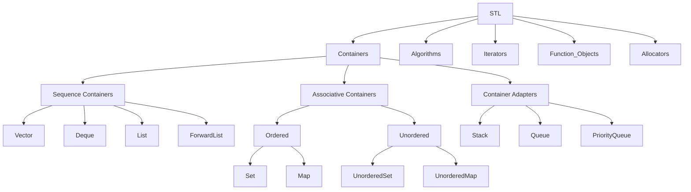

## C++ STL

STL，全称Standard Template Library（标准模板库），是C++标准库的一部分。它包含了一系列的模板类和函数，主要用于数据处理和算法操作。STL的主要内容包括：

1. `容器（Containers）`：如vector、list、deque、set、map等，用于存储和操作数据。
2. `算法（Algorithms）`：如sort、find、copy、for_each等，提供了一系列对容器进行操作的通用算法。
3. `迭代器（Iterators）`：提供了一种方法，可以按照一定的顺序访问容器中的元素，而无需暴露容器的内部表示。
4. `函数对象（Functors）`：这是一种特殊的对象，可以像函数一样被调用。函数对象通常用于创建可定制的算法。
5. `适配器（Adapters）`：如stack、queue、priority_queue等，它们是在其他容器的基础上，提供了不同的接口。
6. `分配器（Allocators）`：用于控制STL容器的内存分配。

| 容器          | 数据结构     | 访问复杂度 | 插入/删除复杂度      | 核心特性                             |
|---------------|--------------|------------|----------------------|--------------------------------------|
| `vector`      | 动态数组     | O(1)       | 尾部 O(1)，其他 O(n) | 内存连续，随机访问快                 |
| `deque`       | 分块双向队列 | O(1)       | 头尾 O(1)，其他 O(n) | 多块内存非连续，支持高效双端扩展     |
| `list`        | 双向链表     | O(n)       | O(1)                 | 任意位置插入删除快，无缓存局部性     |
| `forward_list`| 单向链表     | O(n)       | O(1)                 | 最小化内存开销，仅支持前向遍历       |

| 容器               | 数据结构 | 有序性 | 键唯一性 | 操作复杂度  |
|--------------------|----------|--------|----------|-------------|
| `set/multiset`     | 红黑树   | 是     | 是/否    | O(log n)    |
| `map/multimap`     | 红黑树   | 是     | 是/否    | O(log n)    |
| `unordered_*`      | 哈希表   | 否     | 是/否    | 平均 O(1)   |

| 适配器            | 底层容器   | 操作限制              | 典型应用场景         |
|-------------------|------------|-----------------------|----------------------|
| `stack`           | deque/list | LIFO（仅顶端操作）    | 函数调用栈、撤销操作 |
| `queue`           | deque/list | FIFO（两端操作）      | 任务队列、BFS算法    |
| `priority_queue`  | vector     | 按优先级出队（堆结构）| 调度系统、Dijkstra算法 |



### 99. items

#### 1. 注意unordered_map 的实时性限制是什么？
  在实时性要求极高的场景（如高频交易系统、实时控制系统）中应避免使用 `unordered_map`。其哈希表实现的最坏时间复杂度为 O(n)，可能导致不可预测的延迟。

#### 2. 键值容器的插入行为 - 插入不覆盖原则
```cpp
std::map<std::string, int> table;
table.insert({"小彭老师", 24});
table.insert({"小彭老师", 42});  // 插入失败，值仍为24
```
- **原理**：`insert()` 方法检测到键已存在时，保留原值并返回插入失败的迭代器。

| 方法                | 特性                                                                 |
|---------------------|----------------------------------------------------------------------|
| `operator[]`        | 若键不存在则插入默认值，存在时直接覆盖值                             |
| `insert_or_assign`  | (C++17+) 显式语义，无论键是否存在都会执行插入或覆盖，避免隐式构造损耗 |

```cpp
// C++17 推荐方式
table.insert_or_assign("小彭老师", 24);  // 插入
table.insert_or_assign("小彭老师", 42);  // 覆盖
```


#### 3. 容器元素高效删除 - 删除优化
- **Back-Swap-Erase 模式**  
  利用 `swap` 将待删元素移至末尾后 `pop_back`，避免中间删除导致的大量元素移动。
  ```cpp
  auto it = vec.begin() + target_idx;
  std::swap(*it, vec.back());
  vec.pop_back();
  ```

- **逻辑删除 + 物理压缩**  
  配合 `erase-remove` 惯用法与 `lower_bound` 实现高效区间删除：
  ```cpp
  vec.erase(std::remove_if(vec.begin(), vec.end(), pred), vec.end());
  ```

- **`lower_bound` 方法**
  当 `vector` 是有序的，并且需要删除某个值的所有元素时，可以使用 `lower_bound` 方法。`lower_bound` 会返回一个迭代器，指向第一个不小于给定值的元素。结合 `erase` 函数可以删除指定值的所有元素。

  ```cpp
  #include <vector>
  #include <algorithm>

  void removeAllElements(std::vector<int>& vec, int value) {
      auto it = std::lower_bound(vec.begin(), vec.end(), value);
      while (it != vec.end() && *it == value) {
          it = vec.erase(it);
      }
  }
  ```

#### 4. 安全遍历与删除 - Map 隔元素删除
  利用后置递增避免迭代器失效：
  ```cpp
  for(auto it = m.begin(); it != m.end(); ) {
    auto current = it++;
    if (condition) m.erase(current);
  }
  ```

#### 5. 类型安全增强 - 多态值容器
  使用 `std::any` 实现异构容器：
  ```cpp
  std::map<std::string, std::any> poly_map;
  poly_map["value"] = 42;          // 存储int
  poly_map["name"] = "Alice";      // 存储string
  ```


#### 6. 空间预分配范式
```cpp
std::vector<int> input{1,2,3};
std::vector<int> output;
output.reserve(input.size());  // 必须预分配
std::transform(input.begin(), input.end(), 
              std::back_inserter(output), [](int x){ return x*x; });
```

#### 7. vector问题
尽量不要在vector中存放bool类型,vector为了做优化,它的内部存放的其实不是bool.

### 99. quiz

#### 1. 为什么stl中的内存分配器要设计为一个模板参数而不是一个构造函数参数?

#### 2. 隔一个删除一个map中的元素(主要考察迭代器的失效问题)

#### 3. STL 空间配置器如何处理内存的？

